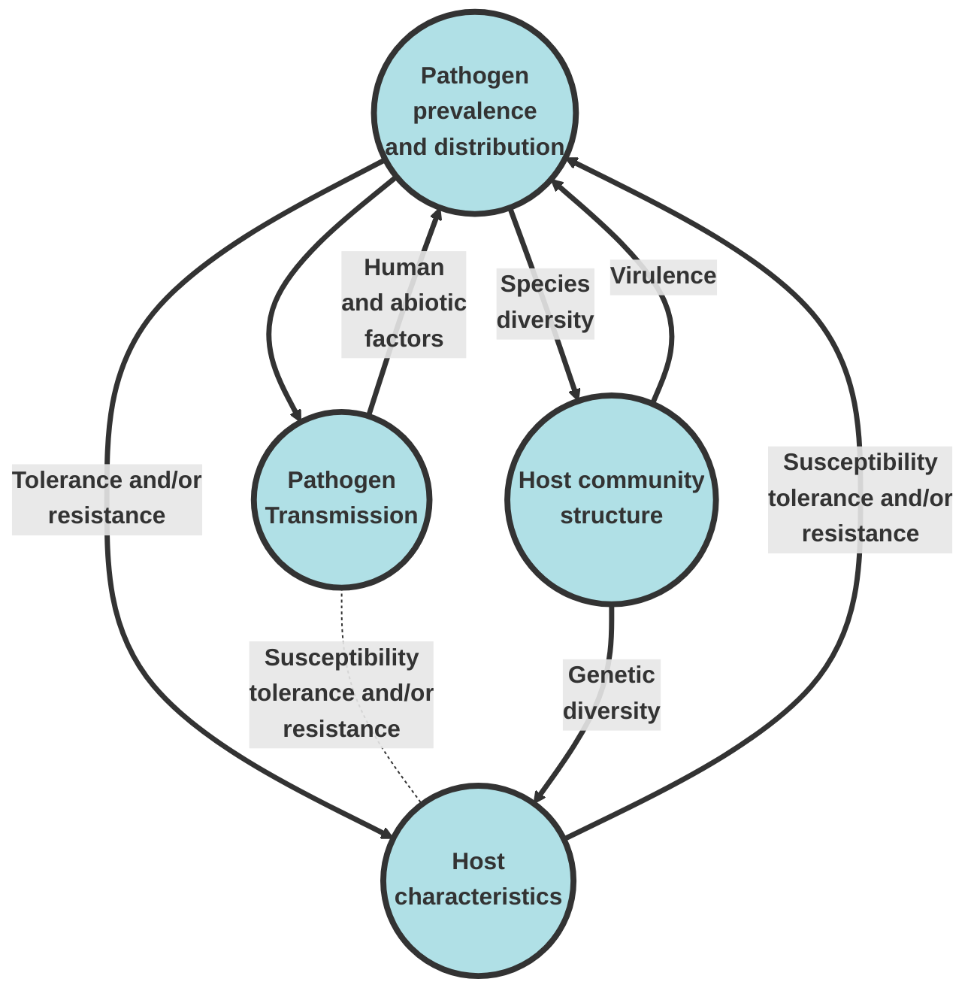

```mermaid
graph TD
	%%E{soil} -> A
	A((<b>Pathogen <br/>prevalence <br/> and distribution)) ==> B((<b>Pathogen<br/> Transmission))
	A ==> |<b>Tolerance and/or <br/> resistance| D((<b>Host <br/> characteristics))
	A ==> |<b>Species <br/> diversity| C((<b>Host community <br/> structure))
	%%C --> B
	B ==> |<b>Human <br/> and abiotic <br/> factors| A
	B -.- |<b>Susceptibility <br/>tolerance and/or <br/> resistance| D
	C ==> |<b>Virulence| A
	C ==> |<b>Genetic <br/> diversity| D
	D ==> |<b>Susceptibility <br/>tolerance and/or <br/> resistance| A
	
    style A fill:#B0E0E6,stroke:#333,stroke-width:4px;
    style B fill:#B0E0E6,stroke:#333,stroke-width:4px;
    style C fill:#B0E0E6,stroke:#333,stroke-width:4px;
    style D fill:#B0E0E6,stroke:#333,stroke-width:4px;
    %%style B fill:#ccf,stroke:#f66,stroke-width:2px,stroke-dasharray: 5, 5;
    
    
```

​	

