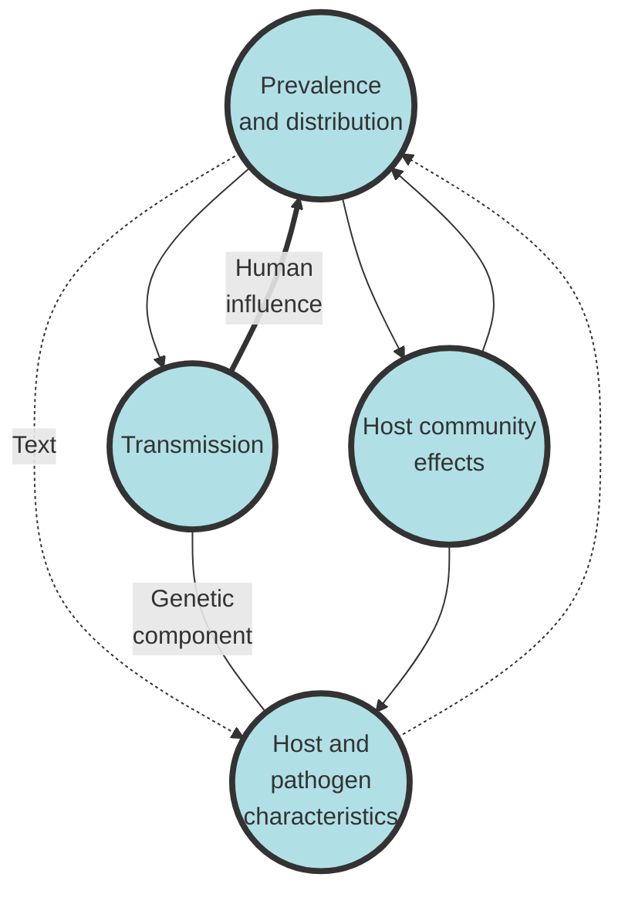

```mermaid
graph TD
	%%E{soil} -> A
	A((Prevalence <br/> and distribution)) -->B((Transmission))
	A -.-> |Text| D((Host and <br/> pathogen <br/> characteristics))
	A --> C((Host community <br/> effects))
	B ==> |Human <br/> influence| A
	B --- |Genetic <br/> component| D
	C --> A
	C --> D
	D -.-> A
	
    style A fill:#B0E0E6,stroke:#333,stroke-width:4px;
    style B fill:#B0E0E6,stroke:#333,stroke-width:4px;
    style C fill:#B0E0E6,stroke:#333,stroke-width:4px;
    style D fill:#B0E0E6,stroke:#333,stroke-width:4px;
    %%style B fill:#ccf,stroke:#f66,stroke-width:2px,stroke-dasharray: 5, 5;
    
    

```

​	

