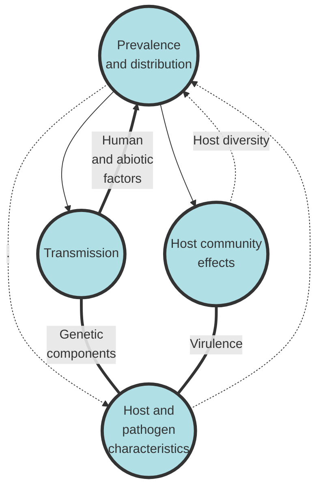

```mermaid
graph TD
	%%E{soil} -> A
	A((Prevalence <br/> and distribution)) -->B((Transmission))
	A -.-> |.| D((Host and <br/> pathogen <br/> characteristics))
	A --> C((Host community <br/> effects))
	B ==> |Human <br/> and abiotic <br/> factors| A
	B === |Genetic <br/> components| D
	C -.-> |Host diversity| A
	C === |Virulence| D
	D -.-> A
	
    style A fill:#B0E0E6,stroke:#333,stroke-width:4px;
    style B fill:#B0E0E6,stroke:#333,stroke-width:4px;
    style C fill:#B0E0E6,stroke:#333,stroke-width:4px;
    style D fill:#B0E0E6,stroke:#333,stroke-width:4px;
    %%style B fill:#ccf,stroke:#f66,stroke-width:2px,stroke-dasharray: 5, 5;
    
    
```

​	

